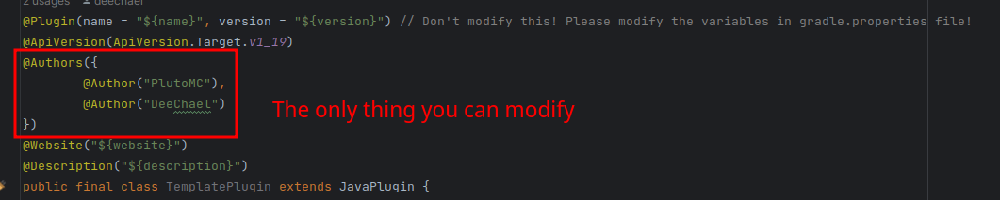

# PlutoMC Plugin Template

English | [简体中文](./README_CN.md)

---

**PlutoMC server plugin template repository which was set up by DeeChael**

**JDK 17 is required!**

Please create new plugin with this template repository!

## How to use?
### 1. Create a new repository and use this repository as the template
Create a new plugin repository, and check "Include all branches" to use advanced branch

### 2. Clone to your local repository and open the project with your IDE, then set your jdk version to 17
Because the build script is using the features added in JDK 17

### 3. Modify the values in the gradle.properties file

**plugin_version** - The version of the plugin\
**plugin_name** - The name of the plugin, shouldn't contain the characters except English letters, numbers or "_" (Regex: [a-zA-Z0-9]+)\
**plugin_display_name** - The display name, can be any characters, used for maven publishing\
**plugin_description** - The description of the plugin\
**plugin_git** - PlutoMC plugin must be open-source, this should head to the git repository\
**plugin_scm_git** - SCM git URL\
**plugin_scm_ssh** - SCM ssh URL\
---
**ossrh_username_system_path** - Should be the environment path name that redirects to the username of your ossrh account\
**ossrh_password_system_path** - Should be the environment path name that redirects to the username of your ossrh password\

**Example:**\
My account is "admin" and password is "123456"\
Set the environment path and result:
```shell
> echo $OSSRH_ACCOUNT
admin
> echo $OSSRH_PASSWORD
123456
```
Then set in gradle properties:
```properties
ossrh_username_system_path = OSSRH_USERNAME
ossrh_password_system_path = OSSRH_PASSWORD
```
And make the comment to codes in build.gradle in **api** module

Means you should change
```groovy
signing {
    var ENV = System.getenv()
    var key = ENV.get(signing_key_base64_system_path)
    var password = ENV.get(signing_password_system_path)
    // useInMemoryPgpKeys(String.join("\n", Files.readAllLines(new File(key).toPath())), password)
    // If you want to publish, make the line above not a comment but a line of codes
    sign publishing.publications.mavenJava
}
```
into
```groovy

signing {
    var ENV = System.getenv()
    var key = ENV.get(signing_key_base64_system_path)
    var password = ENV.get(signing_password_system_path)
    useInMemoryPgpKeys(String.join("\n", Files.readAllLines(new File(key).toPath())), password)
    sign publishing.publications.mavenJava
}
```
---
**signing_key_base64_system_path**:\
Should redirect to the base64 gpg file
#### 1. Generate a gpg key
```shell
gpg --generate-key
```
Result:
```shell
pub   rsa3072 2021-07-25 [SC] [expires: 2023-07-25]
      A36DDCA2B4E3D244AA685BC6C2F673BC0FEB0227
uid           [ultimate] TestTest <example@example.com>
sub   rsa3072 2021-07-25 [E] [expires: 2023-07-25]
```
Remember the second line: A36DDCA2B4E3D244AA685BC6C2F673BC0FEB0227\
And remember the password you set when generating the gpg key
#### 2. Export the key
```shell
gpg --export-secret-keys [The string showed in second line in the previous step] > secret.gpg
```
Example:
```shell
gpg --export-secret-keys A36DDCA2B4E3D244AA685BC6C2F673BC0FEB0227 > secret.gpg
```
#### 3. Generate base64 file
```shell
base64 secret.gpg > secret.gpg.base64
```
Then remember the path to the base64 file and set environment path\
The result be like:
```shell
> echo $SIGNING_KEY
path to key
> echo $SIGNING_PASSWORD
pw123456
```
Then change the gradle properties file
```properties
signing_key_base64_system_path = SIGNING_KEY
signing_password_system_path = SIGNING_PASSWORD
```

**signing_password_system_path** - See the step 1 in "signing_key_system_path"

### 4. Change the package name
Change the package name and DO NOT modify the strings in the annotation on the MainClass, they are used for generating plugin.yml

### 5. Start coding!