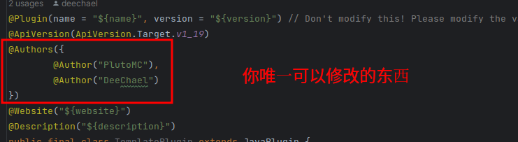

# PlutoMC 插件模板

[English](./README.md) | 简体中文

---

**迁冥 创建的PlutoMC插件开发模板**

**必须使用 JDK 17！**

请使用该模板仓库创建你的插件！

## 如何使用？
### 1. 创建一个新的仓库并使用该仓库作为模板
创建一个新的插件仓库，勾选“Include all branches（包含所有分支）”来通过advanced分支编写插件

### 2. 复制到本地仓库并用你的IDE打开项目，将项目的JDK版本设置为17
因为构建脚本中使用了JDK17的新特性

### 3. 修改gradle.properties中的内容

**plugin_version** - 插件的版本\
**plugin_name** - 插件的名称，只能是英文字母、数字或下划线 (正则表达式: [a-zA-Z0-9]+)\
**plugin_display_name** - 显示名称，可以是任意字符，用来发布到maven仓库使用的\
**plugin_description** - 插件的版本\
**plugin_git** - PlutoMC 的插件必须是开源的，该项应指向于该插件的开源地址\
**plugin_scm_git** - SCM git 链接\
**plugin_scm_ssh** - SCM ssh 链接\
---
**ossrh_username_system_path** - 应该是指向你的OSSRH用户名的系统环境变量的名称\
**ossrh_password_system_path** - 应该是指向你的OSSRH密码的系统环境变量的名称\

**举例:**\
我的帐号是“admin”密码是”123456“
设置好环境变量并测试结果：
```shell
> echo $OSSRH_ACCOUNT
admin
> echo $OSSRH_PASSWORD
123456
```
并在gradle.properties中设定好环境变量的名称
```properties
ossrh_username_system_path = OSSRH_USERNAME
ossrh_password_system_path = OSSRH_PASSWORD
```
将模块 **api** 中build.gradle的signing里的注释前缀删掉使其成为源码

这意味着你应该将
```groovy
signing {
    var ENV = System.getenv()
    var key = ENV.get(signing_key_base64_system_path)
    var password = ENV.get(signing_password_system_path)
    // useInMemoryPgpKeys(String.join("\n", Files.readAllLines(new File(key).toPath())), password)
    // If you want to publish, make the line above not a comment but a line of codes
    sign publishing.publications.mavenJava
}
```
修改为
```groovy

signing {
    var ENV = System.getenv()
    var key = ENV.get(signing_key_base64_system_path)
    var password = ENV.get(signing_password_system_path)
    useInMemoryPgpKeys(String.join("\n", Files.readAllLines(new File(key).toPath())), password)
    sign publishing.publications.mavenJava
}
```
---
**signing_key_base64_system_path**:\
应该指向一个gpg密匙的base64文件
#### 1. 生成GPG文件
```shell
gpg --generate-key
```
Result:
```shell
pub   rsa3072 2021-07-25 [SC] [expires: 2023-07-25]
      A36DDCA2B4E3D244AA685BC6C2F673BC0FEB0227
uid           [ultimate] TestTest <example@example.com>
sub   rsa3072 2021-07-25 [E] [expires: 2023-07-25]
```
记住第二行的内容: A36DDCA2B4E3D244AA685BC6C2F673BC0FEB0227\
记住你在生成密匙时创建的密码
#### 2. 到处密匙
```shell
gpg --export-secret-keys [第二行的内容] > secret.gpg
```
举例:
```shell
gpg --export-secret-keys A36DDCA2B4E3D244AA685BC6C2F673BC0FEB0227 > secret.gpg
```
#### 3. 生成base64文件
```shell
base64 secret.gpg > secret.gpg.base64
```
记住指向base64文件的路径并设置好环境变量\
结果:
```shell
> echo $SIGNING_KEY
指向密匙的路径
> echo $SIGNING_PASSWORD
pw123456
```
然后修改gradle。properties文件
```properties
signing_key_base64_system_path = SIGNING_KEY
signing_password_system_path = SIGNING_PASSWORD
```

**signing_password_system_path** - 见 "signing_key_system_path" 字段的步骤一
### 4. 修改包名
<p style="display: inline-block"> 修改包名并且<h2 style = "display: inline-block">不要</h2> 修改主类的注解，它们是用来生成“plugin.yml”文件的


### 5. 然后就开始写插件吧！